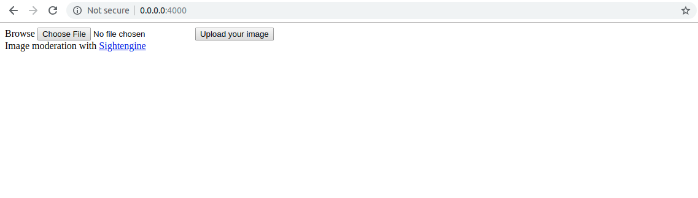
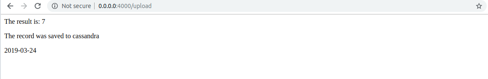

## Flask web Program: Handwritten Digit Reocognition Online
The project develops an online program that predicts the handwritten digits uploaded by client.
The project is based on python 3.7.

Overall:  
  
And the following is the result page:  


### Libraries, platform and framework
1.Flask: http://flask.pocoo.org/      
2.Tensorflow: https://www.tensorflow.org/    
3.keras database: https://keras.io/datasets/  
4.Apache Cassandra: http://cassandra.apache.org/  
5.Docker platform: https://www.docker.com/    
6. HTML  

### Installation 
1. You may first need to download Docker engine from docker website.  
2. You need to pull the image from https://hub.docker.com/r/kyurem/handwritten_digit_recognition  
3. Run the image in local host
Enter command in terminal:
```
docker run -p 4000:80 imrecog
```
4. In any web browser (Note: one needs to disable all proxy before this step), enter 0.0.0.0:4000
5. Select your image (Note: the image must be resized to 28x28 and saved as .png) and press 'upload your image'

### Reference
1. Flask restful service: https://blog.miguelgrinberg.com/post/designing-a-restful-api-with-python-and-flask  
2. https://www.tutorialspoint.com/flask/flask_templates.htm
### License
[](http://badges.mit-license.org)  
Subject to [LICENSE](../LICENSE) 
